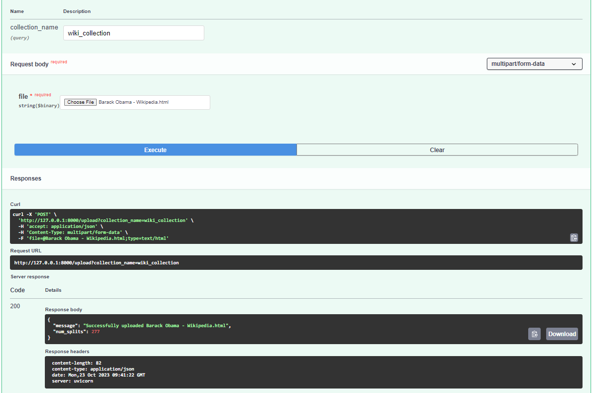
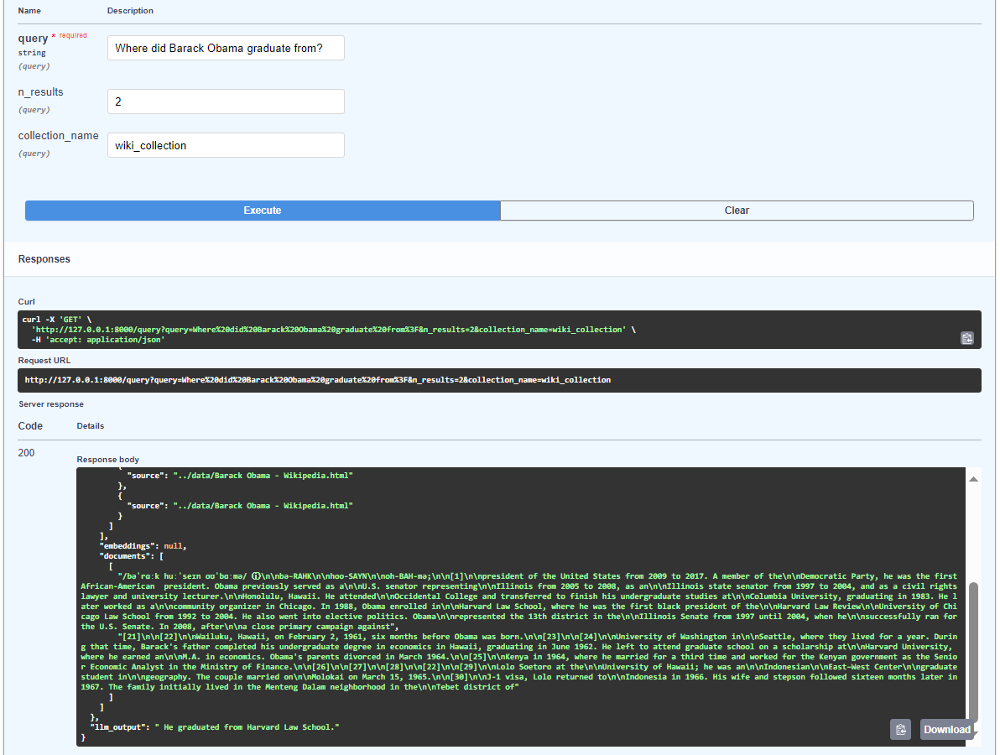

# Retreaval Augmented Generation with LLMs and FAST API


Welcome to the Retrieval Augmented Generation (RAG) repository! This project empowers users to perform Question-Answering (QnA) tasks over their own documents using the state-of-the-art RAG technique. By combining open-sourced Large Language Models (LLMs), Langchain and FastAPI, we provide a powerful and user-friendly platform for handling document-based QnA.

[](https://www.python.org/)
[](https://huggingface.co/models)
[](https://fastapi.tiangolo.com/)
[](https://swagger.io/)
[](https://www.example.com/langchain)
[](https://github.com/ggerganov/llama.cpp)


<p class = 'image-caption' align = 'center'>
<i>RAG Pipeline <a href = "https://docs.aws.amazon.com/sagemaker/latest/dg/jumpstart-foundation-models-customize-rag.html">source</a>.</i>
</p>

## Table of Content
- [Getting Started](#getting-started)
    - [Prerequisites](#prerequisites)
    - [Installation](#installation)
- [Usage](#usage)
    - [Starting the Server](#starting-the-server)
    - [Upload Document](#upload-document)
    - [QnA](#query-document)
- [Advanced Configuration](#advanced-configuration)
    - [Configure LLm Endpoint](#configure-llm-parameters)


## Getting Started
In this section, we'll guide you through setting up and running RAG for your document-based QnA. Follow these steps to get started:

### Prerequisites
Create a vertual python env in your local directory and activate it.
```bash
python3.9 -m venv llm_env/
source activate llm_env/bin/activate
```

### Installation 
1. Clone this repository to your local machine.
```bash
https://github.com/AshishSinha5/rag_api.git
cd rag_api
```
2. Install the required Python packages.
```bash
pip install -r requirements.txt
```
3. The project currntly uses plain C/C++ implementation of LLAMA2 model from this repository [llama.cpp](https://github.com/ggerganov/llama.cpp). The model can be downloaded from [TheBloke](https://huggingface.co/TheBloke/Llama-2-7B-GGUF)'s HuggingFace page.
```bash
wget https://huggingface.co/TheBloke/Llama-2-7B-GGUF/resolve/main/llama-2-7b.Q8_0.gguf
```

## Usage
We'll be using the [SwaggerUI](https://swagger.io/tools/swagger-ui/) (that comes bundled with the FastAPI library) to interact with our API interface.
### Starting the server 
```bash
cd src/rag_app
uvicorn main:app
```
### Opening SwaggerUI
In your favorite browser, go to the following link - 
```text
http://127.0.0.1:8000/docs
``` 
### Upload Document
To upload our document we'll send a POST request. During the upload procedure the following parameters are required - 
- `collection_name` - Name of the vector db where you want to upload your document to. New `db` will be created if the it doesn;t exist already, or the document will be appended to the exisitng `db`.
- `file` - File to be uploaded. Currently only `pdf` and `html` files are supported.


<p class = 'image-caption' align = 'center'>
<i>Uploading Documents to vector_db.</i>
</p>

### Query Document
To perform the QnA on our documents we'll hit the `query/` endpoint of our API. We'll need the following parameters to perform our query - 
- `query` - The query string.
- `n_result` - Number of most similar document chunks to load from our `vector_db` to create the relevant context for our `query`.
- `collection_name` - Name of the `vector_db` we want to query.


<p class = 'image-caption' align = 'center'>
<i>Query Documents Using the LLM.</i>
</p>

## Advanced Configuration

### Configure LLM Parameters
As we start our application the llama2.cpp LLM gets initialized with the default parameters. But we may wish to configure our LLM Model as per our liking. We can use the `init_llm/` endpoint to configure the model. Currently following parameters are available to configure - 
- `n_gpu_layers` - Number of layers to load on the GPU.
- `n_ctx` - Token context window.
- `n_batch` - Number of tokens to process in parallel. Should be a number between 1 and `n_ctx`.
- `max_tokens` - The maximum number of tokens to generate.
- `temperature` - Temperature for sampling. Higher values means more random samples.

As `llama.cpp` model allows for configurable [parameters](https://github.com/langchain-ai/langchain/blob/master/libs/langchain/langchain/llms/llamacpp.py), they may be added in future.